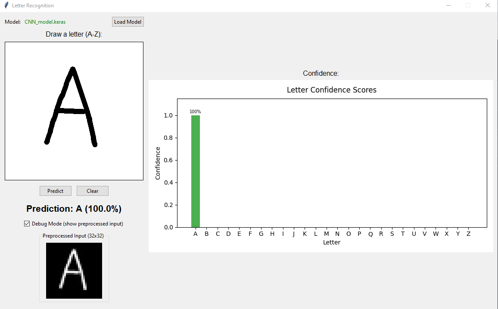

# Letter Recognition
A machine learning project for recognizing handwritten letters (A-Z) using TensorFlow/Keras.

## Preview


## Features
- **extract.py** - Extract letter data from images
- **draw_predict.py** - GUI application to draw letters and see real-time predictions
- **detection_simple.py** - Train Feedforward models on letter datasets
- **detection.py** - Train CNN models on letter datasets
- **detection_commented.py** - Train CNN models on letter datasets (commented)

## Requirements
- Python 3.10+
- TensorFlow 2.20+
- See `pyproject.toml` for full dependencies

## Installation
```bash
uv sync
```
or 
```bash
pip install -r requirements.txt
```

## Usage
Run the drawing GUI:
```bash
python draw_predict.py
```

## Dataset
Training data and pre-trained models are available on the `dataset` branch.

## License
This project is licensed under the MIT License. See the [LICENSE](LICENSE) file for details.
